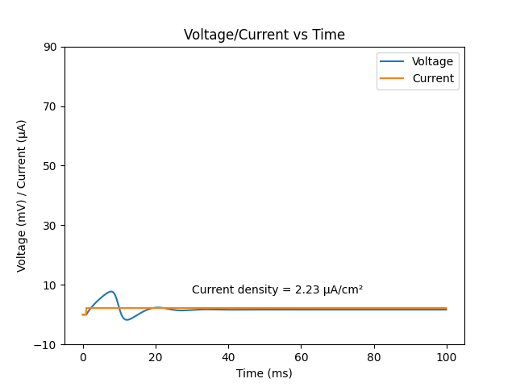
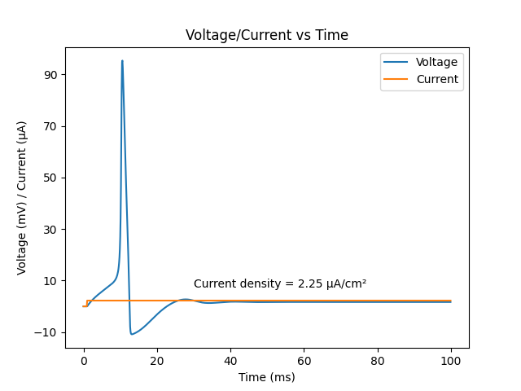
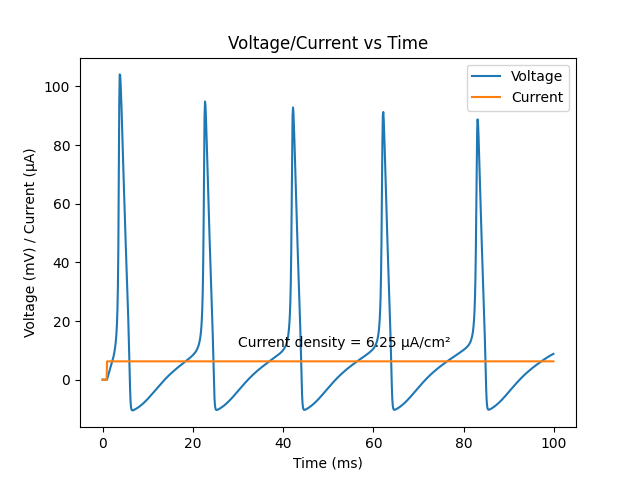
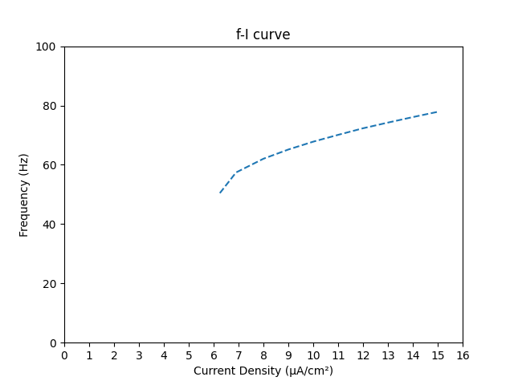

<h1 align="center">Simulation of the Hodgkin-Huxley Model</h1>

<h2 align="right">- Ruban S (2019A7PS0097H)</h2>

<h2 align="center">Introduction</h2>

This assignment is a simulation of the Hodgkin-Huxley Model, which is an electrical $RC$ circuit modelling the action potential in a neuron, more specifically, the giant squid axon, which Hodgkin and Huxley worked on, in their research paper. Hence, the constant values used in the code, pertain to the above-mentioned research paper.

<h2 align="center">Simulation Method</h2>

While the Hodgkin-Huxley model is a first-order differential equation that resembles an $RC$ circuit, the fact that the conductance of the sodium and potassium channels vary with the voltage across the cell membrane in a rather sigmoid manner means that this equation cannot be analytically solved. Hence, this assignment solves the differential equation numerically by using the [**Exponential Euler Rule**](#eer), given that the functions dealt with in this model are exponential decaying functions.

<h3 align="center" id="eer">Exponential Euler Rule</h3>

The exponential Euler rule states that, given a first order differential equation of the form

$\dfrac{dy}{dx} = A-By$

We can use the following recurrence relation to numerically approximate the solution for the differential equation

$y_{i+1} = y_ie^{- \Delta x} + \dfrac{A}{B}(1-e^{-B \Delta x})$

where $\Delta x$ is the timestep of the simulation, and $A$ and $B$ are functions of the independent variable.

The given set of differential equations may look complex, but upon expansion, they appear to fit the above form of differential equation.

$\dfrac{dn}{dt} = \alpha _n (V)(1-n) - \beta _n (V)$

$ = \alpha \_n (V) - (\alpha \_n (V)+\beta \_n (V))n$

Here, $A = \alpha _n (V)$ and $B = \alpha _n (V)+\beta _n (V) = \dfrac{1}{\tau _n}$

$\dfrac{dh}{dt} = \alpha _h (V)(1-h) - \beta _h (V)$

$ = \alpha \_h (V) - (\alpha \_h (V)+\beta \_h (V))h$

Here, $A = \alpha _h (V)$ and $B = \alpha _h (V)+\beta _h (V) = \dfrac{1}{\tau _h}$

$\dfrac{dm}{dt} = \alpha _m (V)(1-m) - \beta _m (V)$

$ = \alpha \_m (V) - (\alpha \_m (V)+\beta \_m (V))m$

Here, $A = \alpha _m (V)$ and $B = \alpha _m (V)+\beta _m (V) = \dfrac{1}{\tau _m}$

The actual differential equation

$C_m \dfrac{dV}{dt} = \bar G_{Na}m^3h(E_{Na}-V) + \bar G_Kn^4(E_K-V) + G_m(V_{rest}-V) + I_{inj}(t)$

can be rewritten as

$\dfrac{dV}{dt} = (\dfrac{\bar G_{Na}m^3hE_{Na} + \bar G_Kn^4E_K + G_mV_{rest}}{C_m}) - (\dfrac{\bar G_{Na}m^3h + \bar G_Kn^4 + G_m}{C_m})V$

Here, $A = \dfrac{\bar G_{Na}m^3hE_{Na} + \bar G_Kn^4E_K + G_mV_{rest}}{C_m}$ and $B =\dfrac{\bar G_{Na}m^3h + \bar G_Kn^4 + G_m}{C_m}$

The timestamp chosen in the simulation is $0.1 ms$ and the duration of the simulation is $100 ms$, hence there are $\dfrac{100 ms}{0.1 ms} = 1000 $ iterations in the simulation.

<h2 align="center">Estimation of Quantities</h2>

The rheobase and superthreshold were empirically determined from the simulation by varying the input current and observing the peak(s) of the action potential.

### Rheobase

The rheobase was observed to be $2.2459 \mu A$ for an area of $1cm^2$ (from the code). From this, the current density is $2.2459 \mu A/cm^2 $. Hence, for a patch of area $900 \pi \mu m^2$, the rheobase comes out to be $2.2459 \mu A/cm^2 \times 900 \pi (10^{-4} cm)^2 = 0.0635 nA$. This is close to the rheobase given in the reading material on the Hodgkin-Huxley model ($0.065 nA$). The corresponding plot can be found under the [Relevant Plots](#plots) section.

### Superthreshold

The superthreshold current was observed to be $6.2495 \mu A$ for an area of $1cm^2$ (from the code). From this, the current density is $6.2495 \mu A/cm^2 $. Hence, for a patch of area $900 \pi \mu m^2$, the rheobase comes out to be $2.2459 \mu A/cm^2 \times 900 \pi (10^{-4} cm)^2 = 0.1767 nA$. The corresponding plot can be found under the [Relevant Plots](#plots) section.

### $f$-$I$ curve

The $f$-$I$ curve was empirically arrived at by varying the current (density) and manually finding out the (average) time period between two action potentials, then plotting a graph with the resulting data. The corresponding plot can be found under the [Relevant Plots](#plots) section.

<h2 align="center" id="plots">Relevant Plots</h2>

### Subthreshold



### Rheobase



### Superthreshold



### $f$-$I$ curve



<h2 align="center">Code</h2>

```Python
import matplotlib.pyplot as plt  # matplotlib for plotting graphs
import numpy as np  # numpy for mathematical functions and handling arrays

A = 1.0  # area of the patch (in cm²)
C_m = 1.0  # Membrance Capacitance (in μF)
G_Na_bar = 120  # maximal sodium conductance (in mS/cm²)
G_K_bar = 36  # maximal potassium conductance (in mS/cm²)
G_m = 0.3  # voltage independent "leak" conductance (in mS/cm²)
E_Na = 115  # sodium reverse potential (in mV)
E_K = -12  # potassium reverse potential (in mV)
V_rest = 10.613  # reverse potential (in mV)
dt = 0.1  # timestep of the simulation
t_start = 0  # start time of the simulation (in ms)
t_end = 100  # end time of the simulation (in ms)
p_start = 1  # start of the pulse current (in ms)
p_dur = 99  # duration of the pulse current (in ms)
p_end = p_start + p_dur  # end time of the pulse current (in ms)
I_inj = ((0.0635 * 1e-3) / (900 * np.pi * (1e-4) ** 2)) * A  # current injected (in μA)


def alpha_n(V):
    return (10 - V) / (100 * (np.exp((10 - V) / 10) - 1))


def beta_n(V):
    return 0.125 * np.exp(-V / 80)


def alpha_m(V):
    return (25 - V) / (10 * (np.exp(-((V - 25) / 10)) - 1))


def beta_m(V):
    return 4 * np.exp(-V / 18)


def alpha_h(V):
    return 0.07 * np.exp(-V / 20)


def beta_h(V):
    return 1 / (np.exp((30 - V) / 10) + 1)


def tau_n(V):
    return 1 / (alpha_n(V) + beta_n(V))


def tau_m(V):
    return 1 / (alpha_m(V) + beta_m(V))


def tau_h(V):
    return 1 / (alpha_h(V) + beta_h(V))


def n_inf(V):
    return alpha_n(V) * tau_n(V)


def m_inf(V):
    return alpha_m(V) * tau_m(V)


def h_inf(V):
    return alpha_h(V) * tau_h(V)


t = np.arange(t_start, t_end, dt)
n = np.zeros(len(t))
m = np.zeros(len(t))
h = np.zeros(len(t))
V = np.zeros(len(t))
I = np.zeros(len(t))

m[0] = m_inf(V[0])
h[0] = h_inf(V[0])
n[0] = n_inf(V[0])

for i in range(int(p_start / dt), int(p_end / dt)):
    I[i] = I_inj  # setting the current

for i in range(len(t) - 1):
    n[i + 1] = n_inf(V[i]) + (n[i] - n_inf(V[i])) * np.exp(-dt / tau_n(V[i]))
    m[i + 1] = m_inf(V[i]) + (m[i] - m_inf(V[i])) * np.exp(-dt / tau_m(V[i]))
    h[i + 1] = h_inf(V[i]) + (h[i] - h_inf(V[i])) * np.exp(-dt / tau_h(V[i]))
    G_Na = G_Na_bar * (m[i + 1] ** 3) * h[i + 1]  # sodium channel conductance
    G_K = G_K_bar * (n[i + 1] ** 4)  # potassium channel conductance
    G_eff = G_Na + G_K + G_m  # 1/R = 1/R1 + 1/R2 + 1/R3 = G1 + G2 + G3 = G
    I_Na = G_Na * E_Na  # I = V/R = VG
    I_K = G_K * E_K
    I_leak = G_m * V_rest
    I_eff = I_Na + I_K + I_leak
    V_inf = (I_eff + (I[i] / A)) / G_eff
    tau_V = C_m / G_eff  # τ = RC = C/G
    V[i + 1] = V_inf + (V[i] - V_inf) * np.exp(
        -dt / tau_V
    )  # Using Exponential Euler rule

plt.plot(t, V)  # Plot voltage varying with time
plt.plot(t, I)  # Plot current varying with time
plt.title("Voltage/Current vs Time")
plt.legend(["Voltage", "Current"])
plt.xlabel("Time (ms)")
plt.ylabel("Voltage (mV) / Current (μA)")
plt.annotate(
    "Current density = {:.2f} μA/cm²".format(round(I_inj, 2)),
    xy=(50, 10),
    xytext=(30, I_inj + 5),
)
plt.show()  # Show plot

```

<script type="text/javascript" src="http://cdn.mathjax.org/mathjax/latest/MathJax.js?config=TeX-AMS-MML_HTMLorMML"></script>

<script type="text/x-mathjax-config">MathJax.Hub.Config({ tex2jax: {inlineMath: [['$', '$']]}, messageStyle: "none" });</script>
